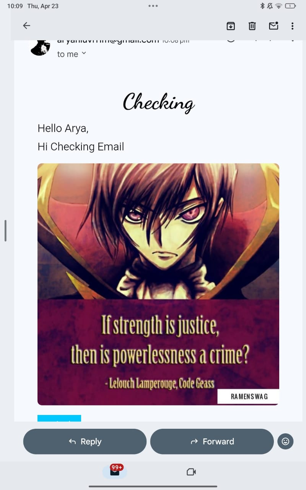
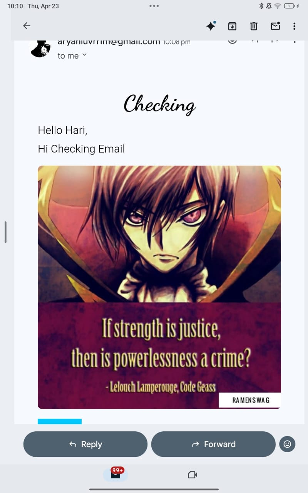

---

# 📧 Bulk Email Sender (Node.js + CSV + EJS)

An **automated bulk email system** built with **Node.js and Express** that sends personalized emails using data from a CSV file.

This project supports **dynamic HTML templates, image attachments, and rate-limited sending**, making it useful for campaigns, notifications, or outreach.

---

## 🚀 Features

* 📄 Upload CSV file (email + name)
* 🖼️ Optional image attachment
* 🎨 Dynamic email templates using EJS
* 📧 Bulk email sending via Gmail SMTP
* ⏱️ Rate limiting (delay between emails)
* 🔁 Retry mechanism for failed emails
* 📊 Success & failure tracking

---

## 📸 Preview
###  <span style="font-family:cursive">output
> 
   
### <span style="font-family:cursive">input

  


---

## 🛠️ Tech Stack

| Category               | Technology       |
| ---------------------- | ---------------- |
| **Backend**            | Node.js, Express |
| **File Upload**        | Multer           |
| **CSV Parsing**        | csv-parser       |
| **Email Service**      | Nodemailer       |
| **Templating**         | EJS              |
| **Environment Config** | dotenv           |

---

## 📂 Project Structure

```id="mailstruct"
├── public/                     # Static files
├── uploads/                    # Uploaded CSV & images
├── routes/
│   └── mailRoutes.js           # Email logic
├── views/
│   ├── index.ejs               # Upload form
│   └── emailTemplates/
│       └── email.ejs           # Email template
├── app.js                      # Main server
├── .env                        # Environment variables
└── README.md
```

---

## ⚙️ How It Works

### 🔹 Step 1: Upload Data

* User uploads:

  * CSV file (email, name)
  * Optional image
  * Subject + message

---

### 🔹 Step 2: Parse CSV

* File is read using `fs.createReadStream()`
* Parsed using `csv-parser`
* Data stored in an array

---

### 🔹 Step 3: Render Email

* EJS template generates personalized HTML
* Injects:

  * Name
  * Message
  * Button link
  * Image (if provided)

---

### 🔹 Step 4: Send Emails

* Uses Nodemailer SMTP (Gmail)
* Sends emails one by one
* Adds **2-second delay** to avoid blocking

---

## 💻 Core Logic

```javascript id="mailcore"
await transporter.sendMail({
    from: process.env.USER,
    to: user.email,
    subject: subject,
    html: html,
    attachments: imageFile ? [{
        filename: imageFile.originalname,
        path: imageFile.path,
        cid: 'myimage'
    }] : []
});
```

---

## ▶️ How to Run

### 🔧 Prerequisites

* Node.js installed
* Gmail account with **App Password**

---

### ⚙️ Setup

```bash id="mailrun"
# Clone repo
git clone https://github.com/your-username/bulk-email-sender.git

# Install dependencies
npm install

# Create .env file
USER=your_email@gmail.com
PASS=your_app_password

# Run server
node app.js
```

---

### 🌐 Open in Browser

```id="mailurl"
http://localhost:3000
```

---

## 📄 CSV Format

```id="csvformat"
email,name
user1@gmail.com,John
user2@gmail.com,Jane
```

---

## 🔐 Important (Gmail Setup)

* Enable **2-Step Verification**
* Generate **App Password**
* Use app password in `.env`

---

## 💡 Key Concepts Used

* File Upload Handling (Multer)
* Stream Processing (CSV parsing)
* Template Rendering (EJS)
* Async/Await (email sending)
* Rate Limiting (delay function)

---

## 🚧 Challenges Faced

### ⚠️ Gmail Blocking Emails

✔ Solved by adding delay (`2 seconds`)

---

### ⚠️ Handling Missing Emails

✔ Skipped invalid entries safely

---

### ⚠️ Template Personalization

✔ Used EJS dynamic rendering

---

## 📈 Future Improvements

* 📊 Dashboard for email stats
* 📩 Queue system (Bull / Redis)
* 🌍 Deploy on cloud (Render/AWS)
* 🔐 OAuth instead of app password
* 📧 Support multiple email providers

---

## ⚠️ Notes

* Avoid sending too many emails quickly
* Respect email service limits
* Use responsibly (no spam)

---

## 🤝 Contributing

```bash id="mailcontri"
# Fork repo
# Create branch
# Make changes
# Submit PR
```

---

## 📜 License

Open-source under **MIT License**

---

## ⭐ Support

If you like this project:

⭐ Star the repo
🍴 Fork it
📢 Share it

---

## 🔥 Real-World Use Cases

* 📢 Marketing campaigns
* 📩 Newsletter sending
* 🎓 Student notifications
* 💼 Job outreach emails

---
<span style="font-family:cursive"> NOTE: In noteswhilelearning.md there are are three updated version codes of emailRoutes.js if you want to send email on particular date and for repeated interval
---
we can do this in future

* 🔥 Add **email tracking (open/click rate)**
* 📊 Build **admin dashboard UI**
* 💼 Make this a **production-level SaaS tool** 🚀
